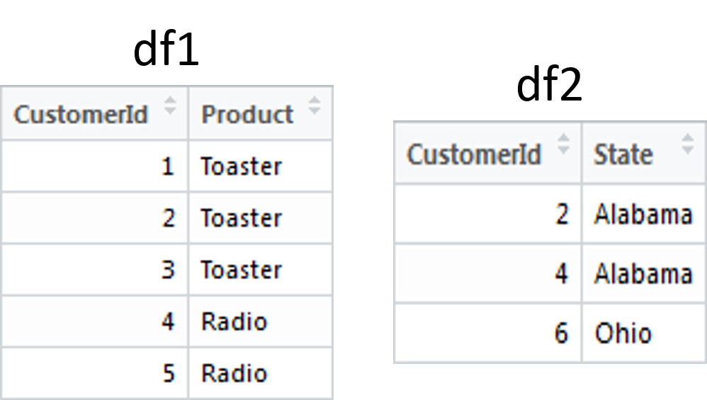

<a href="https://github.com/PO-LAB/Data-Mining" target="_blank">【回到首頁】</a> 
   
------
  
本篇內容為「資料預處理」(或者稱**資料清洗**)的手法上。    

畢竟在資料分析的流程中，其實有60~70%的時間是在進行「資料預處理」，如果沒有好的資料，後續的分析其實就可能會有很大的偏誤。
在「資料預處理」時，我們時常會遇到很多問題需要解決。
當然，也有有很多對應的小技巧，可以幫助我們處理這些問題。

首先，因為我們之後會使用到非常多的套件，故必須先更新R的版本至<a href="http://cran.csie.ntu.edu.tw/" target="_blank">【3.4.0】</a> ，而本篇內容有**資料分割**、**資料合併**、**處理離群值(outlier)**和**轉虛擬變數(Dummy variable)**等技巧！   

------

#**1. 資料分割**   

當我們想要將一個表單切割成不同的子表單時，會使用到以下的函式:
`split()`、`subset()`，以下會詳細介紹其函式的用法。

我們再拿我們熟悉的好朋友，鳶尾花資料(iris)來練習吧^_<

**● 使用`split()`函式進行資料分割:**
```{r}
require(datasets)  # source package
data <- iris
```


```{r}
split_data <- split(data, sample(rep(1:2, 75)))
```

由於rep(1:2,75)產生1,2交錯的向量，但加了前面的sample則是隨機抽取，所以向量1,2會被打亂，split會依照sample(rep(1:2,75))分組，都是1的會在同一組，都是2的也會在同一組。

**● 使用`subset()`函式進行資料分割:**
```{r, results='hide'}
require(datasets)  # source package
data <- iris
subset(data, Sepal.Length > 5) # 只會出現 Sepal.Length > 5 的資料
```


```{r, results='hide'}
subset(data, Sepal.Length == 5,select = c("Sepal.Length","Species")) # 只會出現 Sepal.Length 等於 5 的資料，且欄位只會出現 Sepal.Length 和 Species
```


```{r, results='hide'}
subset(data, Sepal.Length > 5,select = - Sepal.Length) # selct = 負的代表不要出現的欄位
```


------

#**2. 資料合併**   

當我們想要將兩筆資料合併時，會使用到以下的函式:
`rbind()`、`cbind()`、`merge()`，以下會詳細介紹其函式的用法。

**● 使用`rbind()`函式進行資料合併:**
`rbind()`可以用來追加資料，需要對應欄位(變數)名稱
```{r, echo=TRUE}
# 首先先建立兩個 Data frame
ID <- c(1,2,3,4)
Name <- c("A","B","C","D")
Student1 <- data.frame(ID,Name)

ID <- c(5,6,7,8)
Name <- c("E","F","G","H")
Student2 <- data.frame(ID,Name)
```

```{r, echo=TRUE}
# 透過 row 合併
rbind(Student1,Student2)
```

**● 使用`cbind()`函式進行資料合併:**
`cbind()`可以用來新增變數到原本的資料表單中，不需要對應欄位(變數)名稱
```{r, echo=TRUE}
# 首先先建立兩個 Data frame
ID <- c(1,2,3,4)
Name <- c("A","B","C","D")

Score <- c(60,70,80,90)
Sex <- c("M","F","M","M")

Student1 <- data.frame(ID,Name)
Student2 <- data.frame(Score,Sex)
```

```{r, echo=TRUE}
# 透過 column 合併
cbind(Student1,Student2)
```

**● 使用`merge()`函式進行資料合併:**
`merge()`能夠依據兩個表單中共同有的欄位(變數)名稱來合併資料
```{r}
# 首先先建立兩個 data frame
df1 <- data.frame(CustomerId = c(1:5), Product = c(rep("Toaster", 3), rep("Radio", 2)))
df2 <- data.frame(CustomerId = c(2, 4, 6), State = c(rep("Alabama", 2), rep("Ohio", 1)))
```


將兩個 data frame 透過 "CustomerId" 欄位進行合併:
```{r}
# Inner join，保留兩資料集 "CustomerId" 欄位中，取交集的值來合併
merge(x = df1, y = df2, by = "CustomerId")
```
merge 函式的第一、二個參數是指定要合併的資料表，而 by 參數則是指定資料辨識的依據欄位

```{r}
# Full join，保留兩資料集 "CustomerId" 欄位中，取聯集的值來合併
merge(x = df1, y = df2, by = "CustomerId", all = TRUE)
```
all 是用來詢問是否顯示所有欄位的資料

```{r}
# Left join，保留 x (df1表單) "CustomerId" 欄位中的值來合併
merge(x = df1, y = df2, by = "CustomerId", all.x = TRUE)
```

```{r}
# Right join，保留 y (df2表單) "CustomerId" 欄位中的值來合併
merge(x = df1, y = df2, by = "CustomerId", all.y = TRUE)
```
要注意，`merge()`僅針對兩筆具有共同變數的資料進行合併，由於`merge()`會針對by參數所指定的變數做交叉比對，因此該變數的編碼值必須是「單一獨立」且不能「重複」。例如「學號」、「身分證號」等，否則merge會出現個案增多的錯誤結果。

同學們也可以試試看`dplyr`套件來進行資料處理，當資料量很大時，處理速度會比一般的函式還要快一些哦~

------

#**3. 處理離群值(outlier)**   

在探勘的流程中，資料中是否存在離群值(outlier)，可能會嚴重影響到資料分析的結果，甚至會影響到模式建立的正確性。

因此判斷離群值的方法便相當重要，以下將介紹兩種以敘述統計為基礎的離群值判斷方法，包括**標準化分數**、**盒鬚圖**。

**● 標準化分數判斷:**
將資料轉成標準化分數或Z分數進行判斷，根據常態分配的性質，約有99%資料的Z分數會落在平均值的3倍標準差之內，因此Z分數大於3或小於-3的數據將視為離群值(可自訂其他數據為切割點)
```{r}
require(datasets)  # source package
data <- iris
data <- subset(data,select = - Species) # 去除不是數值型態的column
scale_data <- scale(data, center = TRUE, scale = TRUE) # 標準化表單中的數值
scale_data <- as.data.frame(scale_data) # 轉成Data frame型態
scale_data <- subset(scale_data, Sepal.Length < 2 & Sepal.Width < 2 & Petal.Length < 2 & Petal.Width < 2) # 留下全部欄位中，Z分數小於2的值
scale_data <- subset(scale_data, Sepal.Length > -2 & Sepal.Width > -2 & Petal.Length > -2 & Petal.Width > -2) # 留下全部欄位中，Z分數大於-2的值
```

**● 盒鬚圖判斷:**
Tukey(1977)將變數中任何位於內籬（inner fence）與外籬之間的數據視為該變數的潛在離群值。另外，如果變數中有任何數據位於外籬（outter fence）之外的，則視它們為該變數的離群值，外籬指的是Q1向下延伸或Q3向上延伸3倍IQR的距離
```{r}
require(datasets)  # source package
data <- iris
data <- subset(data,select = - Species) # 去除不是數值型態的column
boxplot(data) # 繪製盒鬚圖
summary(data)
data <- subset(data, Sepal.Width < 4 & Sepal.Width > 2) # 留下Sepal.Width欄位中，數值小於4或大於2的值
boxplot(data)
```

處理離群值時，首先應考量懷疑為離群值的數據是否可以被解釋，如果可以，則可依合理的原則處理，例如資料完全不合理即可移除；但如果資料經查證後，不但無誤，而且發現該離群值是來自於非常特殊的個案，我們應該深入瞭解其數據為何如此特別，且必須深入探討決定應該刪除抑或保留該數據。

同學們也可以試試看`outliers`套件來進行離群值判斷，實際跑看看套件中的Example，不過有些時候運用比較簡單的方法處理，說不定效果還會比較好哦~

------

#**4. 轉虛擬變數(Dummy variable)**   

在迴歸分析（線性、羅吉斯…等）中，當自變數為類別變數時，我們都要先進行轉換**虛擬變數(Dummy variable)**的動作，以人工變數量化類別變數，通常取值為0或1。

以下我們使用鳶尾花資料(iris)做練習~

**●使用`dummies`套件轉換 :**
```{r, message=FALSE}
require(dummies)  # 轉換虛擬變數的套件
data <- iris 
```


```{r}
alldummy_data <- dummy.data.frame(data)
```


函式會自動抓取表單中，屬於類別變數的欄位轉換成虛擬變數
```{r}
justdummy_data <- dummy.data.frame(data, all = F)
```


**all = F**，可以只顯示出轉換後的虛擬變數欄位

**●使用`model.matrix`函式轉換 :**
```{r, message=FALSE}
data <- iris
justdummy_data <- model.matrix(~data$Species-1) # 轉換出只有虛擬變數的欄位
alldummy_data <- cbind(data,justdummy_data) # 合併表單by couumn
```
注意:利用**model.matrix**函式轉換的欄位資料型態要為**factor**！！


引入虛擬變數會使得原本的模型變得更複雜，但對於問題的解釋會更清楚，也就是一個方程式能達到兩個方程式的概念，而且較接近現實~

要注意，在模型中引入多個虛擬變數時，虛擬變數的個數要遵守轉換原則：**如果在類別變數欄位中有n種互斥的屬性，則只在模型中引入（n-1）個虛擬變數。**

------

#**總結**    

由於未經處理的資料經常會有資料不完整、不一致或存在雜訊的問題。

因此在資料預處理時就要將這些問題排除，畢竟往後的分析流程都是延續我們預處理完的資料，有好品質的資料才能挖掘出好品質的資訊。

加油~

------
